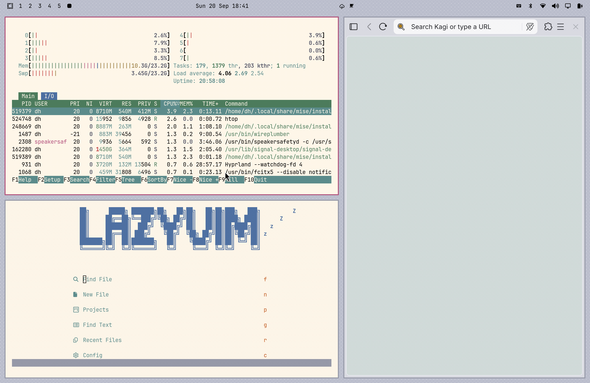

# Solstice — Daylight

An Omarchy theme inspired by the **Solaris 9 Common Desktop Environment (CDE)**.
Calibrated pixel-by-pixel against real CDE desktop screenshots: the signature
grey-lavender chrome, warm cream text canvas, and rose active/selection accent.

This is the **light** variant. See
[Solstice Nightwatch](https://github.com/circumspace/omarchy-theme-solstice-nightwatch)
for the dark companion.

## Preview



## Install

```bash
omarchy theme install https://github.com/circumspace/omarchy-theme-solstice-daylight
```

Then select **Solstice Daylight** from the Omarchy theme picker.

Or manually:

```bash
git clone https://github.com/circumspace/omarchy-theme-solstice-daylight \
  ~/.config/omarchy/themes/solstice-daylight
```

## Palette

| Role | Hex |
|------|-----|
| Chrome (panels, bars) | `#AFB2C3` |
| Canvas (terminal, docs) | `#FAF5EC` |
| Trough / recessed | `#9497A6` |
| Rose (selection, active) | `#B04878` |
| Ink (foreground) | `#000000` |

Full 16-color ANSI palette in [`palette.txt`](palette.txt).

## What's themed

- **Hyprland** — rose active border (`#B04878`), grey-lavender inactive border.
- **GTK 3 / GTK 4** — chrome + rose selection overrides; sharp CDE corners
  (`border-radius: 0`). GTK loads user CSS once at startup, so **restart** GTK
  apps after switching *into or out of* this theme for colors to take.
- **Terminal** — Ghostty / Alacritty / Kitty / foot palettes generated from
  `colors.toml`.
- **Browser chrome** — `chromium.theme` tints Brave/Chromium/Edge frame color
  (light tones are handled via Chromium's MD3 palette; expect subtle results).
- **Neovim** — self-contained `neovim.lua` colorscheme (no plugin dependency).
- **btop, Zed/VS Code, Obsidian, Helix** — generated from `colors.toml`.

## Wallpapers

Five procedurally-generated backdrops in `backgrounds/` (6K, downscale cleanly),
rendered from [NsCDE](https://github.com/NsCDE/NsCDE) XPM tile patterns
recolored to this palette: **Solyaris, Dimple, Dune, Swirl, Squares**.

## Provenance & credits

- Source screenshots: Solaris 9 CDE desktop captures (see [`palette.txt`](palette.txt)).
- B00merang Project's [Solaris-9](https://github.com/B00merang-Project/Solaris-9) port.
- NsCDE backdrops: https://github.com/NsCDE/NsCDE

## Related

- **[Solstice Nightwatch](https://github.com/circumspace/omarchy-theme-solstice-nightwatch)** — the dark companion.

## License

MIT — see [LICENSE](LICENSE).